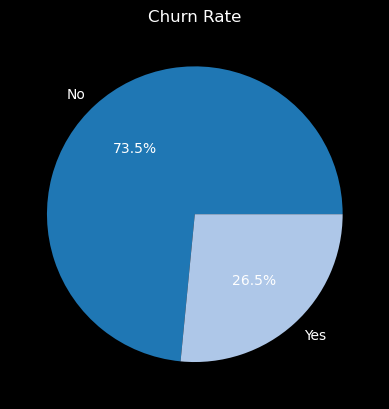
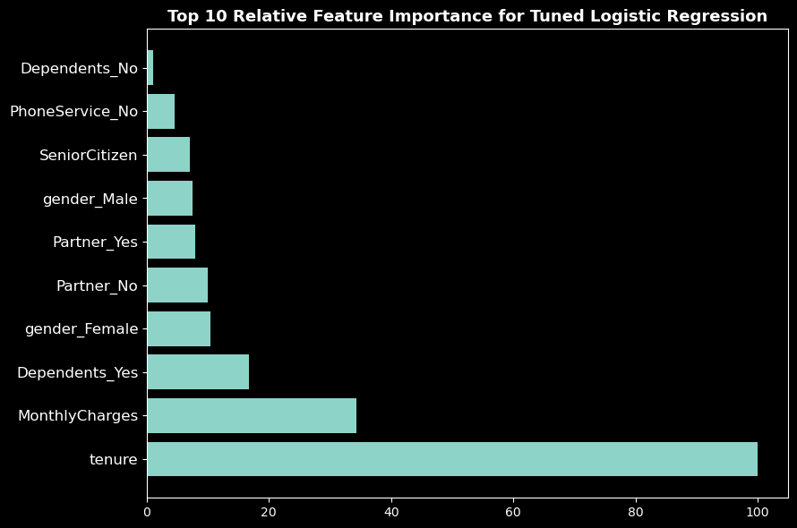

#  CUSTOMER CHURN ANALYSIS FOR TELECOMMUNICATION COMPANY   
   
## BUSINESS UNDERSTANDING    

The objective of this project is to analyze customer churn for a telecommunications company. Customer churn, or attrition, is a critical concern for most telecom companies, as retaining existing customers is often more cost-effective than acquiring new ones. The goal is to perform a comprehensive analysis to understand the factors contributing to customer churn and develop strategies to reduce it. 

Key Objectives:
The primary objectives of this project are as follows:

* Predict Churn: Develop a machine learning model that accurately predicts customer churn based on historical data.
* Identify Factors: Identify the key factors or features that influence customer churn. This will provide insights into what aspects of telecommunications company's services or customer experiences need improvement.
* Take Preventive Actions: Use the model's predictions to take preventive actions, such as targeted marketing campaigns, personalized offers, or customer support interventions, to reduce churn. 
## DATA UNDERSTANDING    
The data is obtained from kaggle:[Telco Customer Churn](https://www.kaggle.com/datasets/blastchar/telco-customer-churn)   

The columns include:      
``customerID``: A unique identifier for each customer.    
``gender``: The gender of the customer (categorical: 'Male' or 'Female').   
``SeniorCitizen``: Indicates whether the customer is a senior citizen (binary: 0 for 'No,' 1 for 'Yes').    
``Partner``: Indicates whether the customer has a partner (binary: 'Yes' or 'No').  
``Dependents``: Indicates whether the customer has dependents (binary: 'Yes' or 'No').  
``tenure``: The number of months the customer has stayed with the company(numeric).  
``PhoneService``: Indicates whether the customer has phone service (binary: 'Yes' or 'No').   
``MultipleLines``: Indicates whether the customer has multiple phone lines (categorical: 'No phone service,' 'No,' or 'Yes').    
``InternetService``: The type of internet service subscribed by the customer (categorical: 'DSL,' 'Fiber optic,' or 'No').   
``OnlineSecurity``: Indicates whether the customer has online security (categorical: 'No,' 'Yes,' or 'No internet service').    
``OnlineBackup``: Indicates whether the customer has online backup (categorical: 'No,' 'Yes,' or 'No internet service').  
``DeviceProtection``: Indicates whether the customer has device protection (categorical: 'No,' 'Yes,' or 'No internet service').   
``TechSupport``: Indicates whether the customer has tech support (categorical: 'No,' 'Yes,' or 'No internet service').     
``StreamingTV``: Indicates whether the customer has streaming TV (categorical: 'No,' 'Yes,' or 'No internet service').    
``StreamingMovies``: Indicates whether the customer has streaming movies (categorical: 'No,' 'Yes,' or 'No internet service').   
``Contract``: The type of contract the customer has (categorical: 'Month-to-month,' 'One year,' or 'Two year').   
``PaperlessBilling``: Indicates whether the customer prefers paperless billing (binary: 'Yes' or 'No').   
``PaymentMethod``: The payment method used by the customer (categorical: 'Electronic check,' 'Mailed check,' 'Bank transfer (automatic),' or 'Credit card (automatic)').   
``MonthlyCharges``: The amount of the customer's monthly charges (numeric).   
``TotalCharges``: The total amount the customer has been charged (numeric).    
``Churn``: The target variable indicating whether the customer has churned (binary: 'Yes' or 'No')  
# EXPLORATORY DATA ANALYSIS

#### churn rate   
The dependent variable is the 'Churn' column, which represents whether a customer is likely to churn or not. It is the variable we want to predict. The independent variable(s) are the predictors used to predict the dependent variable
   
The pie chart shows that the majority of customers (73.45) did not churn, while a small minority of customers (26.5%) did churn.  

# MODELING
models used:
* Logistic Regression Model
* Random Forest classifier
* KNN 
* Tuned logistic regression
## Model Evaluatio
Tuned logistic regression performed better than the other models in predicting churn

### Most Important features of The Tuned Logistic Regression 
  
Features that had most significant impact on the target variable in the model:  

* Tenure (Months): Tenure is the most critical feature, with a feature importance score of 100. This means that the longer a customer has been with the company, the less likely they are to churn. Building long-term customer relationships is essential for reducing churn.
* Monthly Charges: Monthly charges also have a significant impact on churn, with a feature importance score of approximately 34. Customers with higher monthly charges are more likely to churn. This suggests that pricing strategies and value-added services may play a crucial role in retention efforts.
* Dependents: The presence of dependents, specifically when customers have dependents (Dependents_Yes), is an important factor in reducing churn (feature importance score of about 16.8). Customers with dependents may be more likely to stay with the company, possibly due to the stability of family services.

# RECOMMENDATIONS
The recommendation is driven from the most significant features and the Exploratory data analysis.These recommendations can help prevent customer churn 
* Offering incentives for customers to stay longer, as tenure plays a critical role.
* Evaluating and potentially adjusting pricing strategies to retain customers with higher monthly charges.
* Providing targeted offers or promotions to customers with dependents, as they are less likely to churn
* Enhance Onboarding Experience: Improve the onboarding experience for new customers to reduce early churn. Provide ample support, information, and guidance during their initial tenure.
* Gather Feedback: Continuously monitor customer satisfaction, especially among those with short tenures, and gather feedback to address common pain points.
* Pricing Strategies: Evaluate pricing strategies for customers with higher monthly charges and offer discounts, promotions, or cost-effective plans to retain them.
* Monitoring and Retention: Keep a close watch on high monthly charge customers, implement proactive retention strategies, and provide excellent customer support and loyalty programs.
* Service Quality Improvement: Assess and enhance the quality of Fiber Optic service, which has a high churn rate, by identifying and addressing service-related issues.
* DSL Service Promotion: Promote DSL internet service to price-sensitive customers by offering competitive pricing and service bundles.
* Contract Promotion: Encourage longer-term contracts with incentives like discounted rates or special offers to increase customer loyalty.
* Customer Communication: Maintain regular communication with month-to-month contract customers to educate them on the benefits of switching to longer-term contracts.
* Encourage Customer Loyalty: Implement strategies to reward customer loyalty, particularly by offering incentives to those with longer tenure and increasing TotalCharges.
* Focus on Retaining New Customers: Implement engagement and retention strategies for new customers with shorter tenures and higher monthly charges.
* Value-added Services: Offer value-added services, personalized offers, or discounts to customers with higher monthly charges to increase perceived value.
* Customer Segmentation: Segment customers based on tenure and monthly charges to tailor retention efforts effectively and create targeted campaigns.  

#### AUTHOR:         
marwa Osman: marwaosman9975@gmail.com    

👉 [LinkedIn](https://www.linkedin.com/in/marwa-osman-00190b222/)

👉 [GitHub](https://github.com/marwa9975)